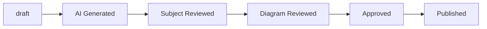

# Math Content Curation Workflow
## Diagram Engine - Geometry Rescue Flow MVP

### Overview
This document outlines the complete workflow for curating Math content from JEE previous papers and NCERT concepts into structured, reviewable learning objects with rescue ladders.

### Content Philosophy
**We build content infrastructure, not content dumping.**

- ✅ **DO**: Convert official/reference material into structured learning objects
- ❌ **DON'T**: Copy NCERT textbook content verbatim
- ✅ **DO**: Use NCERT for concept mapping, prerequisites, and learning sequence
- ❌ **DON'T**: Reproduce NCERT exercises or examples directly
- ✅ **DO**: Generate original explanations and solutions
- ❌ **DON'T**: Use copyrighted material without proper transformation

### Workflow Stages

#### 1. Source Material Input
```
JEE Previous Papers → Raw Question Data
NCERT Chapters → Concept Mapping (no copying)
```

**Input Sources:**
- JEE Main previous-year papers (with metadata: year, session, paper, shift)
- NCERT Mathematics chapters (Class 7-9) for concept alignment only
- Original content created by content engineers

#### 2. Content Processing Pipeline
```
Raw Data → Concept Tagging → Prerequisite Mapping → Question Structuring → Rescue Ladder Generation
```

**Processing Steps:**
1. **Extract**: Parse raw questions and topics
2. **Normalize**: Convert to standardized format
3. **Tag Concepts**: Map to canonical concept IDs from `content/math/concepts.yaml`
4. **Map Prerequisites**: Link to NCERT-aligned prerequisite concepts
5. **Structure**: Apply `content_schema.json` validation
6. **Generate Rescue**: Create foundation → bridge → target progression

#### 3. Quality Assurance
```
Schema Validation → Business Rule Check → Human Review → Approval
```

**Quality Gates:**
- Schema compliance (automated)
- Business rule validation (automated)
- Academic review (human)
- Copyright review (human)
- Final approval (human)

#### 4. Publication Pipeline
```
Approved Content → Export → Flutter App Integration → Student Mode
```

**Publication Stages:**
- `draft` → `ai_generated` → `subject_reviewed` → `diagram_reviewed` → `approved` → `published`

### File Structure

```
content/
├── schema.json                    # Content schema definition
├── math/
│   └── concepts.yaml              # Concept taxonomy with prerequisites
├── ncert/
│   ├── math_class_7_map.yaml     # NCERT Class 7 concept mapping
│   ├── math_class_8_map.yaml     # NCERT Class 8 concept mapping
│   └── math_class_9_map.yaml     # NCERT Class 9 concept mapping
├── sample_questions/              # Generated questions
├── rescue_ladders/
│   └── geometry_regular_polygon.yaml  # Rescue ladder definitions
└── validation_report.json         # Validation results

tools/
├── import_jee_questions.py        # JEE question import pipeline
└── validate_content.dart          # Schema and business rule validator
```

### Content Schema Requirements

Every question must include:

#### Required Fields
- `question_id`: Unique identifier (format: `source_subject_topic_number`)
- `source_type`: `jee_previous_paper`, `ncert_aligned`, or `original_content`
- `primary_concept`: Canonical concept ID from concepts.yaml
- `prerequisites`: List of prerequisite concept IDs
- `class_level`: NCERT class alignment
- `bridge_level`: `foundation`, `school`, or `jee`
- `difficulty`: `easy`, `medium`, or `hard`
- `question_text`: Complete question text
- `correct_answer`: Right answer
- `solution_steps`: Step-by-step solution
- `rescue_question_ids`: Foundation and bridge question IDs
- `review_status`: Current workflow status

#### Conditional Requirements
- **JEE Questions**: Must have ≥1 prerequisite, ≥2 rescue questions, diagram required
- **Multiple Choice**: Must have why-wrong explanations for incorrect options
- **Diagram Questions**: Must have diagram_id and diagram_specification

### Rescue Ladder System

#### Three-Level Progression
For every JEE question, generate three levels:

1. **Foundation Level** (Class 8-9)
   - Familiar concept with smaller numbers
   - Focus on basic understanding
   - Example: Square central angle (90°)

2. **Bridge Level** (Class 9-10)
   - Intermediate complexity
   - Introduces new techniques
   - Example: Hexagon central angle with trigonometry

3. **Target Level** (JEE)
   - Full JEE complexity
   - Multiple concepts integrated
   - Example: Octagon-square area problem

#### Rescue Ladder Example
```
Foundation: Square → 90° central angles
Bridge: Hexagon → 60° central angles + trigonometry
Target: Octagon → 45° central angles + cosine law
```

### Review Workflow

#### Review States


#### Review Roles
- **Content Engineer**: Schema compliance, concept tagging, rescue ladder generation
- **Academic Reviewer**: Mathematical accuracy, pedagogical quality, difficulty assessment
- **Copyright Specialist**: Source attribution, originality, commercial use safety
- **Final Approver**: Publication decision, quality sign-off

#### Review Checklists

**Academic Reviewer Checklist:**
- [ ] Concept tag correct for this question?
- [ ] Prerequisites complete and appropriate?
- [ ] Difficulty accurate for target audience?
- [ ] Question text clear and unambiguous?
- [ ] Answer mathematically correct?
- [ ] Solution steps correct and complete?
- [ ] Why-wrong explanations meaningful?
- [ ] Diagram necessary and useful?

**Copyright Reviewer Checklist:**
- [ ] Source material properly attributed?
- [ ] Adaptations from source clearly documented?
- [ ] Content lineage metadata complete?
- [ ] Wording original (not copied verbatim)?
- [ ] Solution explanation original?
- [ ] Commercial use rights clear?
- [ ] No NCERT textbook copying?

### Quality Metrics

#### Scoring System (85+ Threshold)
- **Concept Tagging Completeness** (20%): Primary concept, prerequisites, secondary concepts
- **Prerequisite Mapping** (15%): All prerequisites exist and are appropriate
- **Why-Wrong Explanations** (15%): Clear explanations for incorrect options
- **Rescue Ladder Quality** (15%): Appropriate foundation and bridge questions
- **Diagram Usefulness** (15%): Diagrams are necessary and well-specified
- **Solution Clarity** (10%): Steps are clear, correct, and easy to follow
- **Copyright Safety** (10%): Content is original or properly attributed

#### Publishing Requirements
- Quality score ≥ 85
- Academic review complete
- Copyright review complete
- All schema validations passed
- No business rule violations

### Validation Tools

#### Automated Validation
```bash
# Validate entire pipeline
dart run tools/validate_content.dart pipeline

# Validate sample questions
dart run tools/validate_content.dart content/sample_questions

# Validate specific file
dart run tools/validate_content.dart content/sample_questions/question.json
```

#### Validation Rules
- Schema compliance (JSON Schema)
- Business rule validation (custom rules)
- Cross-reference validation (concept IDs, rescue question IDs)
- Format validation (question IDs, diagram IDs)

### Content Generation Process

#### Step 1: Import JEE Questions
```python
python3 tools/import_jee_questions.py
```
- Parses raw JEE question data
- Maps to canonical concepts
- Generates structured JSON
- Creates rescue ladders automatically

#### Step 2: Human Review
- Academic reviewer validates mathematical accuracy
- Copyright reviewer checks compliance
- Feedback incorporated into revisions

#### Step 3: Validation
```bash
dart run tools/validate_content.dart pipeline
```
- Ensures all content meets schema requirements
- Validates business rules
- Generates validation report

#### Step 4: Publication
- Content marked as `published`
- Available for Flutter app integration
- Ready for student mode

### MVP Scope: Geometry Rescue Flow

#### Target Content
- **10 JEE geometry questions** with full metadata
- **30 rescue/bridge questions** (3 per JEE question)
- **10 interactive diagrams** with specifications
- **Complete concept taxonomy** for geometry
- **Schema validator** with business rules
- **Review workflow** with checklists

#### Success Criteria
- All 50 questions pass schema validation
- Quality scores ≥ 85 for published content
- Complete rescue ladders for all JEE questions
- Human review process documented
- Flutter app integration tested

#### Next Steps After MVP
- Scale to additional chapters (Trigonometry, Quadratic Equations)
- Add more complex rescue ladders
- Implement automated quality scoring
- Expand reviewer team and workflow

### Important Constraints

#### Copyright Compliance
- **NCERT**: Use only for concept mapping, not content copying
- **JEE Papers**: Pattern analysis and original question generation
- **Original Content**: Full creative freedom with proper attribution

#### Quality Over Quantity
- Start with 50 high-quality questions (not 10,000)
- Focus on geometry rescue flow first
- Prove student engagement before scaling
- Maintain 85+ quality threshold

#### Technical Requirements
- All content must be schema-compliant
- Rescue ladders must be complete for JEE questions
- Diagram specifications must be detailed
- Review workflow must be documented

### Integration with Flutter App

#### Export Format
Content exports to Flutter-compatible JSON with:
- QuestionData models
- Concept graphs
- Rescue ladders
- Diagram specifications

#### App Integration Points
- Learner Mode uses rescue ladders
- Question display uses diagram specifications
- Progress tracking uses concept graphs
- Review mode shows why-wrong explanations

---

## Quick Start Guide

### 1. Set Up Environment
```bash
# Install dependencies
pip install pyyaml jsonschema
# Dart SDK should be installed for validation
```

### 2. Import JEE Questions
```bash
cd /path/to/diagram-engine
python3 tools/import_jee_questions.py
```

### 3. Validate Content
```bash
dart run tools/validate_content.dart pipeline
```

### 4. Review Content
- Use checklists in `content/review/`
- Update review status in JSON files
- Ensure quality score ≥ 85

### 5. Publish
- Set `review_status: "published"`
- Content ready for Flutter integration

---

This workflow ensures high-quality, copyright-compliant Math content with effective rescue ladders that prevent student drop-off while maintaining academic rigor.