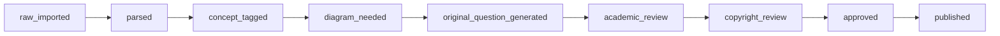

# Diagram Engine Content Pipeline

A structured content factory for creating high-quality, original STEM learning content with built-in copyright compliance and academic review workflows.

## Overview

This pipeline transforms raw educational materials (JEE papers, NCERT references) into structured, app-ready learning objects with:

- **Concept mapping** and prerequisite ladders
- **Original practice questions** with mistake patterns
- **Visual diagram specifications** for interactive explanations  
- **Rescue ladders** for struggling students
- **Human review workflows** for academic and copyright validation

## Architecture

```
content_pipeline/
├── schemas/           # JSON schemas for all content types
├── sources/           # Raw source materials (JEE papers, references)
├── concepts/          # Concept taxonomy and learning graphs
├── questions/         # Individual practice questions
├── review/            # Review status and workflow tracking
├── export/            # Human-reviewable CSV/JSON exports
└── scripts/           # Processing and validation tools
```

## Content Types

### 1. Source Materials (`schemas/source_material.json`)
Raw educational content with copyright tracking:
- JEE previous papers
- NCERT syllabus references  
- Textbook citations
- Original content

### 2. Concept Nodes (`schemas/concept_node.json`)
Learning concepts with:
- Prerequisite relationships
- Class level alignment
- JEE relevance scoring
- Common misconceptions
- Diagram requirements

### 3. Question Items (`schemas/question_item.json`)
Practice questions with:
- Multiple difficulty levels (foundation → mock exam)
- Mistake pattern analysis
- Step-by-step solutions
- Rescue ladder references
- Diagram specifications

### 4. Rescue Ladders (`schemas/rescue_ladder.json`)
Structured intervention paths for struggling students:
- Concept reviews
- Simpler questions
- Visual explanations
- Progressive difficulty

### 5. Diagram Specifications (`schemas/diagram_spec.json`)
Technical specifications for interactive diagrams:
- Element definitions
- Animation sequences
- Interaction requirements
- Learning objectives

## Workflow Stages

Content progresses through these stages:



### Stage Descriptions

- **raw_imported**: Initial parsing from source materials
- **parsed**: Structured according to schemas
- **concept_tagged**: Linked to concept taxonomy
- **diagram_needed**: Visual requirements identified
- **original_question_generated**: Transformed from source to original
- **academic_review**: Academic accuracy validation
- **copyright_review**: Legal compliance check
- **approved**: Ready for app integration
- **published**: Live in the application

## Getting Started

### 1. Setup Environment

```bash
cd content_pipeline
python3 -m venv venv
source venv/bin/activate  # On Windows: venv\Scripts\activate
pip install jsonschema
```

### 2. Parse JEE Papers

```python
from scripts.jee_parser import JEEPaperParser

parser = JEEPaperParser(".")
parsed_data = parser.parse_jee_paper(jee_paper_data)
parser.save_parsed_content(parsed_data)
```

### 3. Validate Content

```python
from scripts.content_validator import ContentValidator

validator = ContentValidator(".")
is_valid, errors = validator.validate_content(question, "question_item")
```

### 4. Export for Review

```python
from scripts.export_manager import ExportManager

exporter = ExportManager(".")
questions_csv = exporter.export_questions_to_csv()
dashboard = exporter.export_review_dashboard()
```

## Content Strategy

### Priority Chapters (Mathematics)

1. **Coordinate Geometry** - High diagram value
2. **Trigonometry** - Many misconceptions  
3. **Quadratic Equations & Functions** - School to JEE bridge
4. **Geometry/Mensuration/Circles** - Best for rescue ladders
5. **Calculus Basics** - Visual area/slope diagrams

### Question Distribution per Chapter

- 20 NCERT-aligned foundation concepts
- 50 original foundation questions
- 50 bridge questions  
- 50 JEE-pattern questions
- 20 rescue ladders
- 10 mock-test sets

## Copyright Compliance

### NCERT Guidelines
✅ **Allowed:**
- Syllabus alignment
- Concept sequencing
- Prerequisite mapping
- Learning outcomes
- Reference tagging

❌ **Avoid:**
- Direct textbook copying
- Solved examples
- Diagram reproduction
- Exercise republishing

### JEE Paper Usage
✅ **Allowed:**
- Pattern mining
- Style analysis
- Difficulty assessment
- Concept frequency

❌ **Needs Review:**
- Direct question reproduction
- Commercial redistribution
- Attribution requirements

## Quality Standards

### Academic Requirements
- [ ] Accurate mathematical content
- [ ] Clear step-by-step solutions
- [ ] Appropriate difficulty progression
- [ ] Concept alignment verified

### Pedagogical Requirements  
- [ ] Learning objectives defined
- [ ] Mistake patterns identified
- [ ] Rescue paths available
- [ ] Diagram specifications clear

### Technical Requirements
- [ ] Schema validation passed
- [ ] Prerequisites mapped
- [ ] Status tracking current
- [ ] Export formats working

## Review Process

### 1. Academic Review
- Content accuracy
- Concept alignment
- Difficulty appropriateness
- Solution quality

### 2. Copyright Review  
- Source attribution
- Usage permissions
- Commercial rights
- NCERT compliance

### 3. Final Approval
- All reviews passed
- Technical validation
- Export ready
- App integration tested

## Team Roles

- **Content Engineer**: Parsing, transformation, schema compliance
- **Academic Reviewer**: Subject matter validation, pedagogy review
- **Copyright Specialist**: Legal compliance, source attribution
- **Final Approver**: Publication decision, quality sign-off

## Export Formats

### CSV for Human Review
- Questions review spreadsheet
- Concepts review spreadsheet  
- Batch review exports

### JSON for Integration
- Review dashboard data
- Batch processing files
- API-ready content

### Metrics and Analytics
- Pipeline statistics
- Quality metrics
- Review priorities
- Copyright status

## Scripts Reference

### `jee_parser.py`
- Parse JEE paper data
- Generate structured questions
- Extract metadata and references

### `content_validator.py`
- Schema validation
- Business rule checking
- Quality assessment

### `export_manager.py`
- CSV export generation
- Review dashboard creation
- Batch processing exports

## Best Practices

### Content Creation
1. Start with concept taxonomy
2. Build foundation questions first
3. Create rescue ladders early
4. Add diagrams progressively
5. Review at each stage

### Quality Assurance
1. Validate schemas automatically
2. Review academic accuracy manually
3. Check copyright compliance
4. Test diagram specifications
5. Verify rescue paths

### Pipeline Management
1. Track status changes
2. Monitor review backlogs
3. Prioritize high-value content
4. Maintain source references
5. Document decisions

## Troubleshooting

### Common Issues

**Schema Validation Errors**
- Check JSON syntax
- Verify required fields
- Review data types

**Copyright Status Stuck**
- Verify source metadata
- Check attribution requirements
- Review usage permissions

**Export Generation Fails**
- Check file permissions
- Verify directory structure
- Validate data integrity

### Getting Help

1. Check schema documentation
2. Review error logs
3. Validate sample data
4. Contact role specialists

## Future Enhancements

- Automated concept tagging
- AI-powered mistake pattern detection
- Interactive diagram generation
- Real-time quality metrics
- Mobile app integration APIs

---

**Generated with Diagram Engine Content Pipeline v1.0**